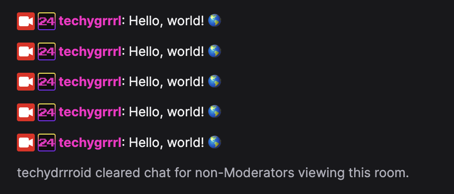

# twitch chat spamrrr

Configure an application and get an access token from the Twitch CLI. You can follow [these instructions](https://blog.techygrrrl.stream/chat-bot-twitch-tmijs-typescript#heading-authenticating) to do so but TLDR if you already have an app registered and configured with the Twitch CLI, run this:

    twitch token -s 'chat:read chat:edit' -u

